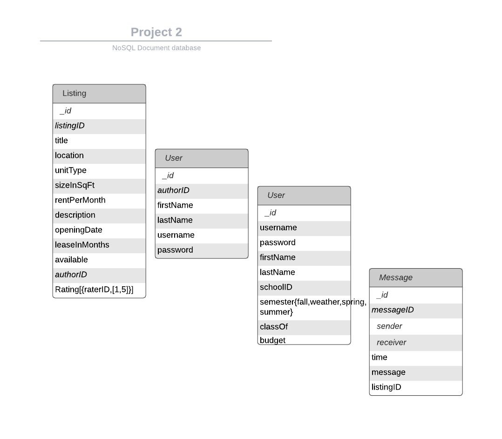

# StudentHousingFinder

## Original Project Proposal:

An application that lets users explore a list of student housing.

It will support:

- CRUD dorm/apartment listings
- Sort and filter by location/building, cost, or by user input
- Owner/renter (user) sign-up/login
- CRUD user information
- Users can rate dorm/apartment listings

## Installation and Execution

1. Clone the repository
2. In terminal: `npm install`
   Imports:
3. To import listings:
   `mongoimport -h localhost:27017 -d project2 -c listings --file ./db/Listing.json --jsonArray`
4. To import messages:
   `mongoimport -h localhost:27017 -d project2 -c messages --file ./db/Message.json --jsonArray`
5. To import users:
   `mongoimport -h localhost:27017 -d project2 -c users --file ./db/Student.json --jsonArray`
   `mongoimport -h localhost:27017 -d project2 -c users --file ./db/Owner.json --jsonArray`
6. To import schools:
   `mongoimport -h localhost:27017 -d project2 -c schools --file ./db/Schools.json --jsonArray`

7. In terminal: `npm start`
8. In browser, go to http://localhost:3000

> _Register and Sign In Note:
> Because owners and students have different permissions for listings, page will look different depending on whether you sign up as an owner or a student._

## Authors:

Bernard Ekezie (https://github.com/bekezie) & Ely (Esther) Lam (https://github.com/ely-lam)

@Ely Lam implemented:

- Registering the owners and updating their listings as they post new housing listings.
- CRUD operations on the listings.
- Making sure owners have permissions to CRUD listings, but students can only view them.
- CRUD operations on the messages between users and ensuring each message has one distinct sender and one distinct receiver.
- Making sure users can only delete messages they sent.
- Create warning if users try to register with non-unique username.
- Search listings by certain criteria (finds all that matches at least one of the search criteria but not all criteria).
- Making instructions on setup and importing collections to localhost.

@Bernard Ekezie implemented:

- Registering the students and updating their ratings per listing.
- CRUD operations on the students and schools
- CRUD operations on the ratings
- CRUD operations on the user and ensuring users have a unique username.

# Project 2 (Part 2: Design):

Link to Business Requirements: https://docs.google.com/document/d/1U-KUPu-nW8fwHIpMbF03xYfmWVMdTYuDPdS_fJP_PdY/edit
\*Found in ./design/CS5200_Project2_BusinessRequirements.pdf

UML Diagram

ER Diagram

